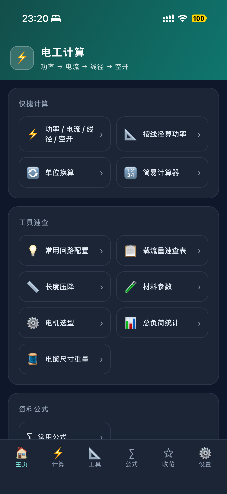
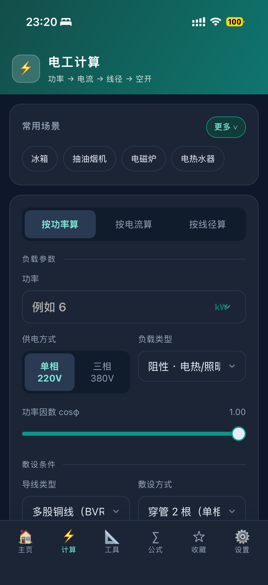
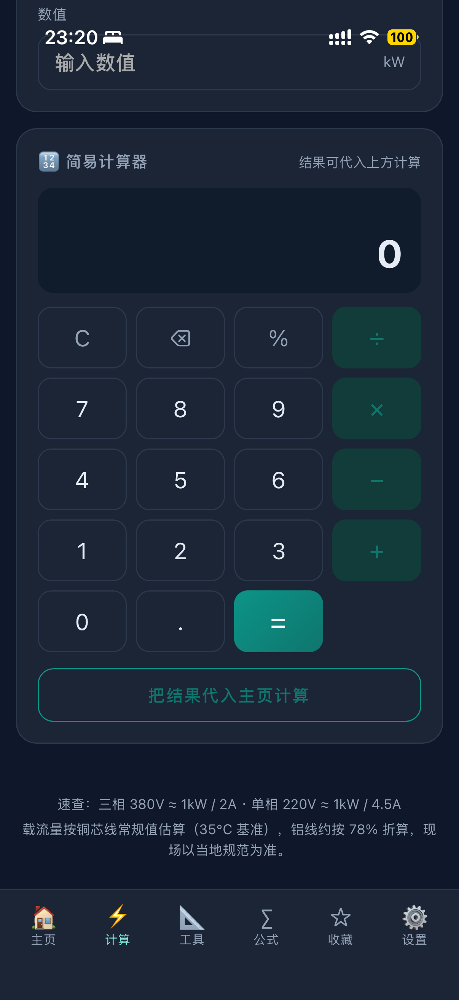
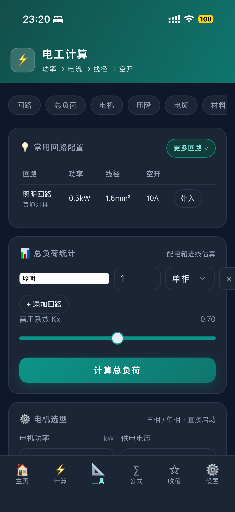
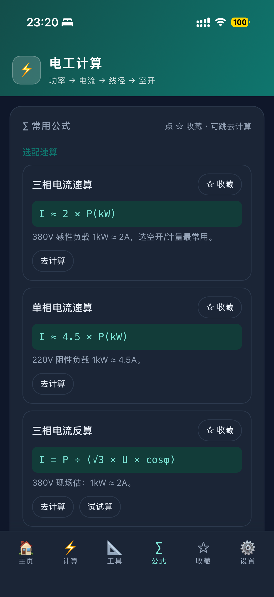
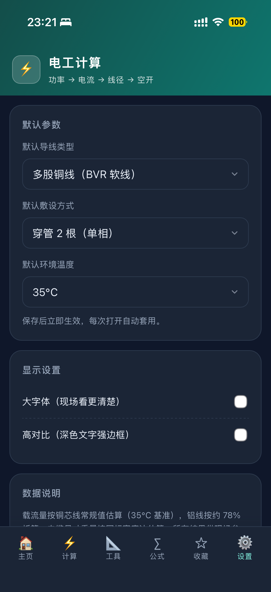

# ⚡ 电工计算

> 水电安装现场专用计算工具 · PWA · 离线可用

一款为水电安装师傅设计的现场计算工具，主线一条路走完：**功率 → 电流 → 线径 → 空开/漏保**。所有数据保存在手机本地，断网也能用，不收集任何个人信息。

## ✨ 功能

- 🏠 **主页总入口**：所有功能分类汇总、带图标，点一下直达
- ⚡ **计算（核心）**
  - 单相 220V / 三相 380V，功率因数 cosφ 可调
  - 功率单位：kW / W / HP（国内公制）
  - 三种模式：按功率算 / 按电流算 / 按线径算
  - 导线类型：BVR 软线 / BV 硬线 / 铝线
  - 敷设方式与温度修正，线路长度自动校核电压降
  - 结果可收藏、可一键生成配电箱标注卡
- 🛠 **工具**：常用回路配置、总负荷统计、电机选型（380V/220V）、长度压降、电缆尺寸重量、材料参数、载流量速查表
- 🔄 **单位换算**：功率 / 长度 / 温度 / 线径 mm²–AWG，输入即换算
- 🔢 **简易计算器**：加减乘除、百分号，结果一键代入主页计算
- ∑ **公式库**：按使用频率排序的常用公式，可收藏、可试算
- ☆ **收藏**：计算结果与公式，支持单条分享、全部导出备份
- ⚙ **设置**：默认参数、大字体 / 高对比、全量数据备份与恢复

## 📱 使用

手机 Safari 打开 `https://mx10085.github.io/dian-gong-ji-suan/` → 点「分享」→「添加到主屏幕」，即可像 App 一样全屏使用，离线可用。

## 📷 截图

| 主页 | 计算（输入） |
| --- | --- |
|  |  |

| 计算（结果） | 工具 |
| --- | --- |
|  |  |

| 公式 | 收藏 |
| --- | --- |
|  |  |

| 设置 |
| --- |
|  |

## 🛠 技术说明

- 纯前端 PWA（HTML + CSS + JavaScript），无后端、无第三方依赖
- Service Worker 缓存：在线自动更新，离线完整可用
- 历史、收藏、默认设置等数据全部保存在浏览器本地
- 部署于 GitHub Pages，推送 `main` 分支自动发布

## 📊 数据口径与免责声明

- 载流量按铜芯线常规值估算（35℃ 基准），铝线约按 78% 折算
- 电缆尺寸与重量按国标密度法估算（铜 8.89 / 铝 2.70 g/cm³）
- 电机选型按直接启动、启动电流约 6 倍估算
- **所有结果均为估算参考，现场请以当地电气规范、设计图纸和厂家样本为准**

## 👤 作者

智信水电 · 微信：717700632
